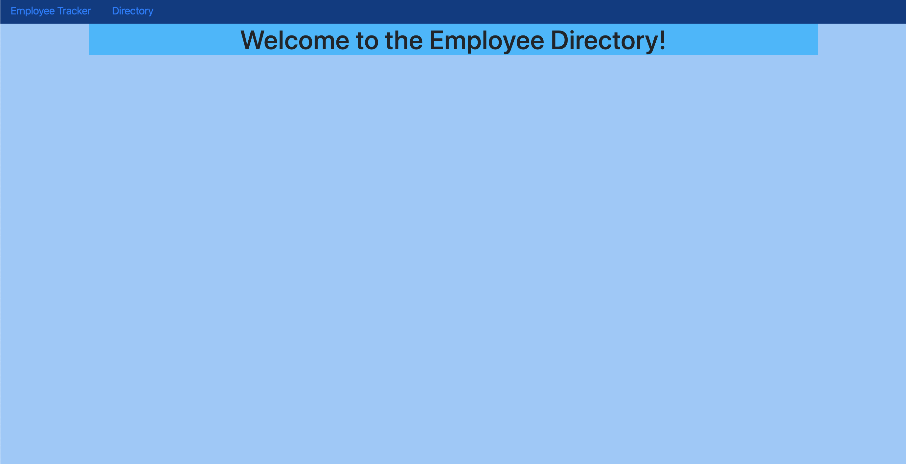
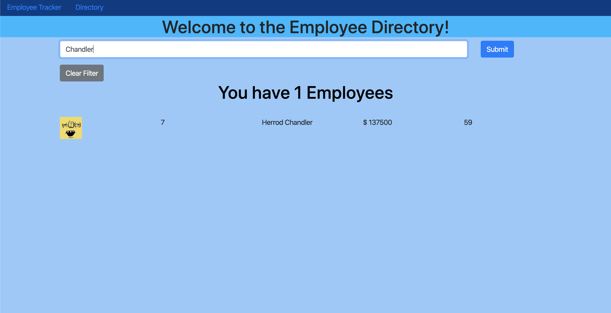
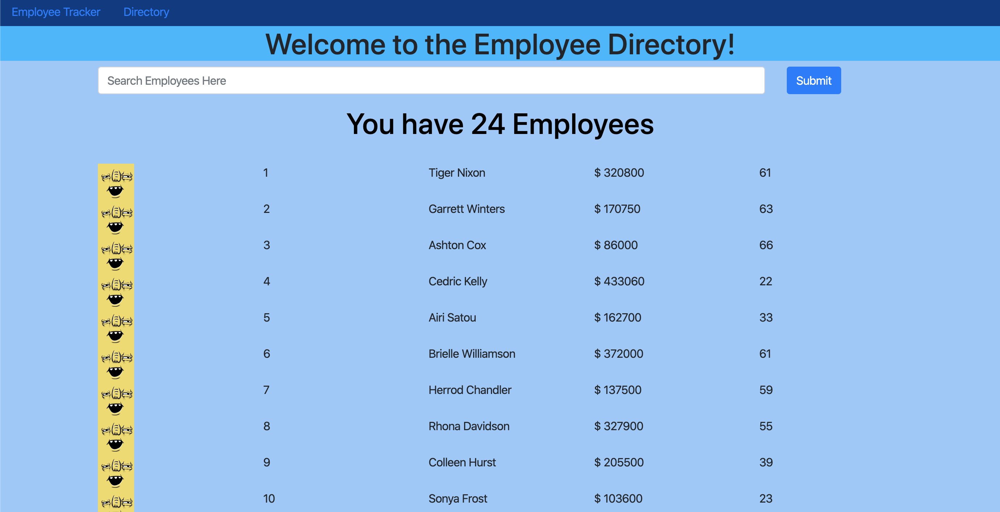
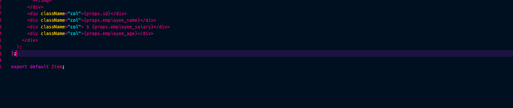
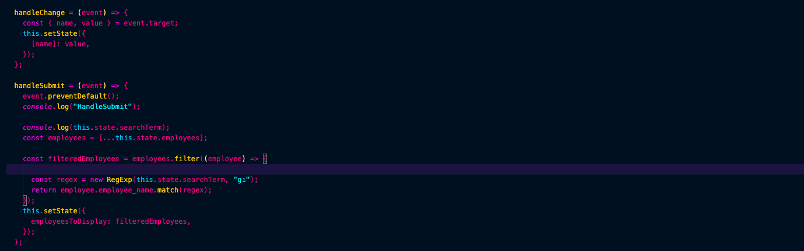

# Employee Tracker

## Search for Employee's by Name

## It displays Employee name, ID, Salary and Age

### We are calling the "dummy.employee's" API using Axios

### We set are props to what we want to get back from API

### Then we are taking the results and changing the State

### When we change State is when the results are Displayed

#### Built Using React
